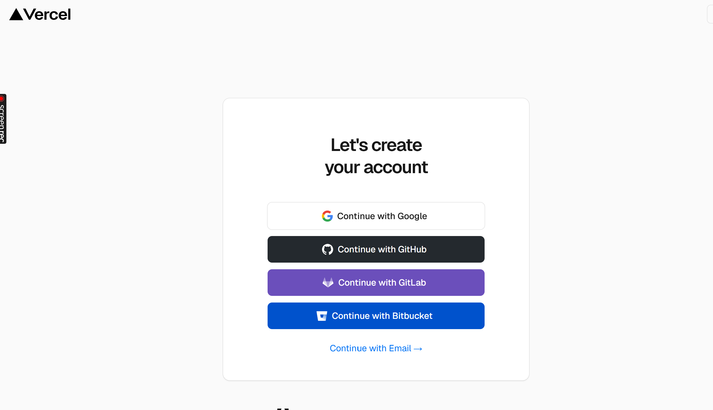
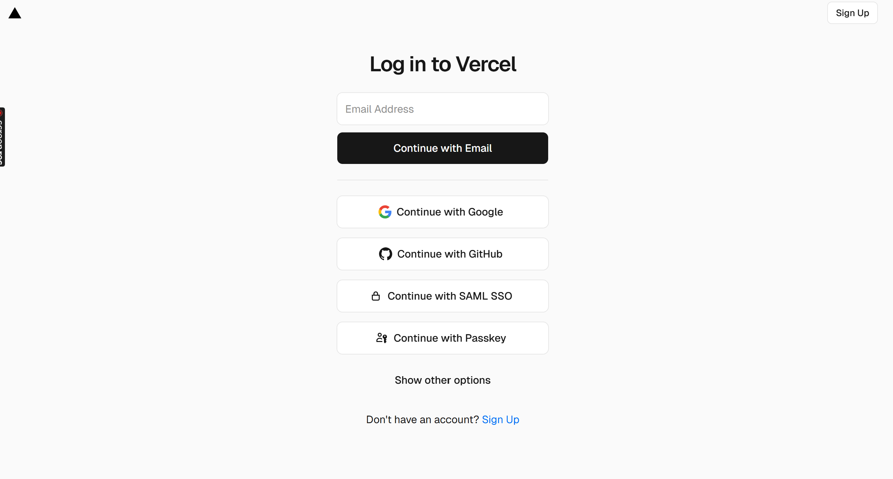
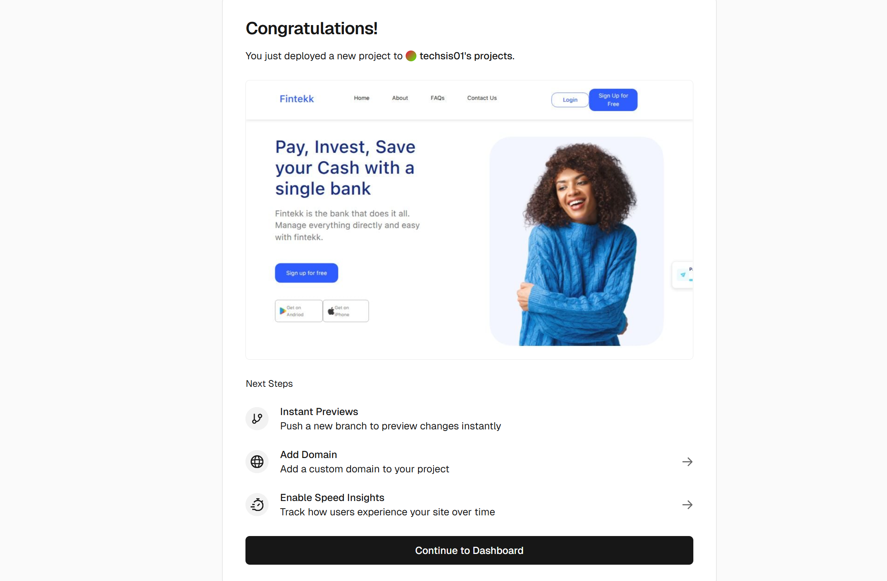
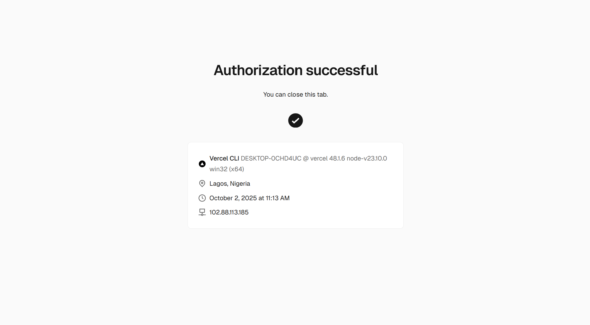
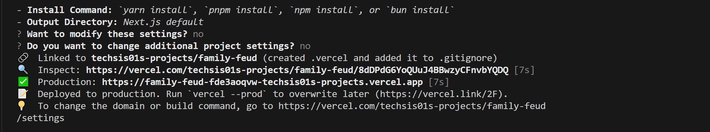

You have just developed a stunning  website with HTML, CSS, and JavaScript, but it currently sits on your local machine, accessible to you alone. To share your website with the world, you’ll need to deploy it to a server and get a public URL.

Vercel is a frontend cloud tool that is used for building and deploying modern web applications. It is a platform that readily provides developers with all the tools and infrastructure they need to  deploy their web apps with ease.

In this guide, we’ll walk you through two different methods:
* Deployment via Vercel dashboard
* Deployment via the command line interface (CLI)

and the steps from each method that will take your device from being accessible only on your local machine to having a public url using Vercel.


## Pre-requisites
Before we begin, ensure you have the following set up,  to proceed with the tutorial: 
* A static website built with HTML,CSS, JavaScript (or a frontend framework e.g Nextjs, Vue)
* A GitHub account.
* Node.js installed on your computer. 

At the end of this tutorial, you will understand how to deploy applications on Vercel, using either the Vercel dashboard or the command line interface (CLI) and your static website will be live with its own public link.

## Deployment via the dashboard
1. Visit Vercel’s official [website](https://vercel.com/) and click on the [signup](https://vercel.com/signup) button to create a new account.You can create an account with your email address or one of the Git platforms listed.
:::note
 In this tutorial, we are working with Github so that you can automatically link your Vercel account to your Github account.  
:::



2. If you have a Vercel account already, log in to continue using your email or Github account. 


3. Once logged in, you will be redirected to the import project page where Vercel displays your project repositories from Github.  Search and select the project from your list of repositories click on import. 


4. After importing your project, you will be redirected to the project configuration screen. Vercel detects the necessary configurations needed to deploy your application, set your project name and optionally change the build and output settings. If your project has environment variables, you can also store them here. 

5. When you are comfortable with all your project settings, go ahead and click on deploy. 


6. Deployment will take a few seconds to a few minutes, depending on the size of the project. And once deployment is complete, you will be redirected to a success page, where you can get the link to view your deployed project. 




## Deployment via the CLI
What if you don’t want to go all the way to using vercel’s dashboard. Vercel ensures that once you’re done coding and you are satisfied with your work, you can just deploy your app right from your VsCode terminal. You don’t have to be an expert with the CLI to achieve this task, follow the steps below to deploy your application on Vercel via the command line

1. Navigate to your project folder on VSCode.
2. Open your terminal, and make sure you are in your  project directory. 
3. Run the command below to install Vercel globally using the npm.

```bash
npm i -g vercel
```
Your installation will be complete after a few seconds.

4. Confirm the version of Vercel installed by running the command.
```bash
vercel –version. 
```

5. Run ```vercel login```, to login to authenticate your device with Vercel and login into your account.

6. Click **ENTER** on your keyboard and you will be redirected to page on your browser to verify the device you are using with vercel.


7. Click on allow to begin the device verification process,it only takes a few minutes. And after a successful verification, close to the tab and return to your VsCode terminal.



8. You’re logged in now, proceed to deploy your application by running ```vercel``` in the CLI.


9. You will be prompted to answer a few questions concerning the project, and you  either  click Y/N. Use the table below as your guide to answer the deployment questions:

| Question | What it means | Common Answer |
| :---- | :---- | :---- |
| Set up and deploy “path/to/project”? | Confirms you want to deploy the detected project. | Yes |
| Which scope should contain your project? | Selects which account/team owns the project.	 | Your personal account (or team if you’re working in one). |
| Link to existing project?	 | Connects to a project already created on Vercel. | No, for new projects |
| What’s your project’s name? | The name that will be shown in the Vercel dashboard and project URL.	 | frontend-project (or choose something meaningful) |
| In which directory is your code located? | Path to your source code. | ./ (root) unless you use a subfolder.  |
| Want to modify these settings? | Let's you override auto-detected framework settings. | No (unless you need custom settings).  |
| Do you want to change additional project settings? | Let's you configure advanced project options.	 | No (you can adjust later in the dashboard).  |


After answering the questions, Vercel will run the build process, and after a few seconds, a link to your live site will be displayed. Click on the production link to preview your live site.   


If you encounter any errors while deploying, click on the **Inspect** link to view your build logs and deployment summary. This will help you identify any errors and their reasons, aiding in your debugging.

Congratulations\!  Your website is now live with Vercel. Whether you used the dashboard or the CLI, your project is publicly accessible and automatically redeploys whenever you push updates. With Vercel, you’ve set up not just hosting, but also the foundation for scaling and continuous deployment.  For instructions on configuring a custom domain for your project, refer to [Vercel’s official documentation](https://vercel.com/docs/domains/working-with-domains/add-a-domain). 