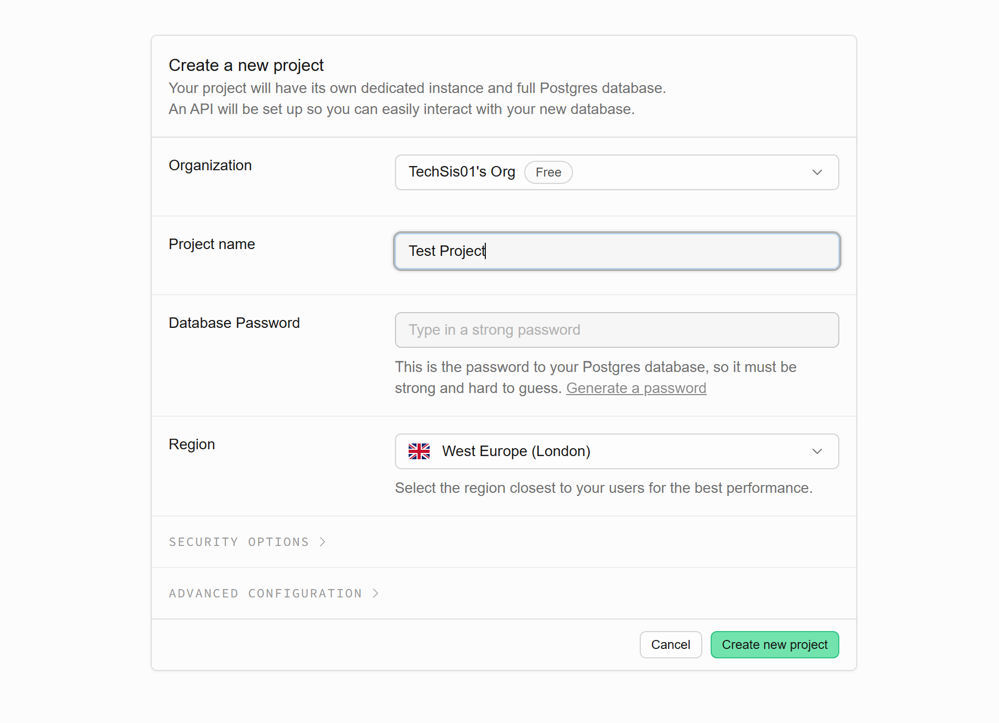
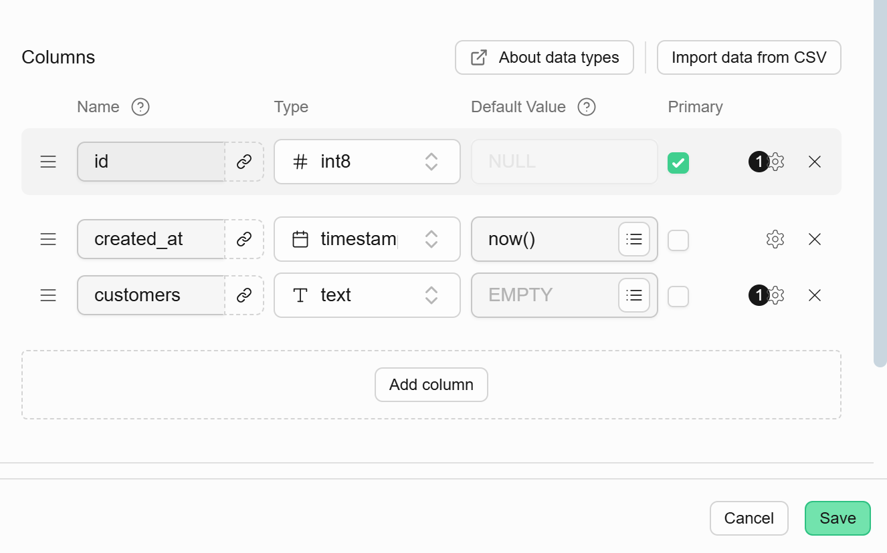
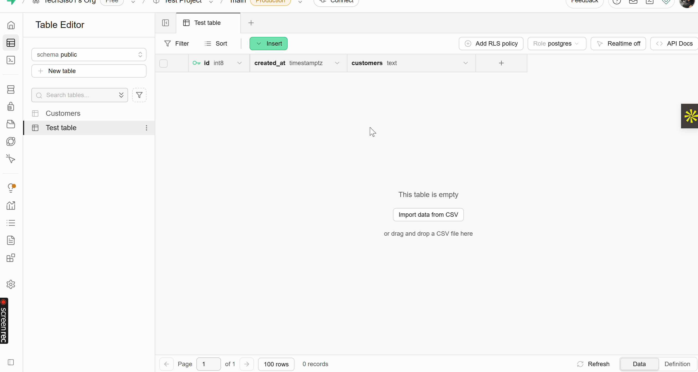
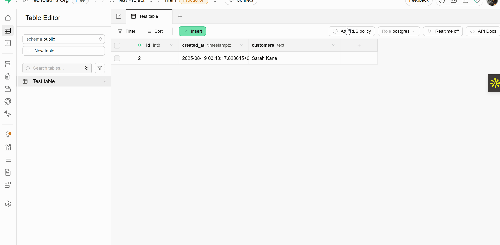

Let’s get you started with using Supabase in a React app. By the end of this tutorial, you’ll know how to:

1. Set up a new Supabase project
2. Add some sample data to your database
3. Fetch and display that data in your React app

## Pre-requisites
Before we begin, make sure you have:

- The latest version of Node.js installed on your machine
- A basic React project set up.

Once you have all that ready, you're good to go!

### Step 1: Create a Supabase Project

Visit [database.new](https://database.new/) to create a new Supabase project.

:::note
If this is your first time,you will be prompted to sign up for a Supabase account, we recommend signing up with your Github account for a smoother experience. 
:::
Enter a project name that reflects what you’re building, and set a strong password to secure the PostgreSQL database that will be created for you automatically.
Once done, click **Create New Project** to proceed to the next step.


### Step 2: Setup your Database
In Supabase, data is stored in tables. Think of a table like a spreadsheet: each column represents a type of information, and each row represents a single entry of that information.

You can set up your database using either the [Table Editor](https://supabase.com/dashboard/project/_/editor) or the [SQL Editor](https://supabase.com/dashboard/project/_/sql/new). For this tutorial, we’ll use the Table Editor to get you started.

Let’s create a simple table called Customers to store a list of customers for a product.

By default, Supabase adds an id column and a created_at column to your table. You can remove them if you want, but for this tutorial we’ll keep them. Next, add a new column for your customers. Once you’re done, click Save to create the table.

### Step 3: Inset a Row
Once your table with columns are created, click on the insert button at the top of the table to enter your first data entry.


### Step 4: Add RLS Policy
To make your database publicly readable, create an RLS Policy and enable read access for all users. 


### Step 5: Install Supabase Client Library
```supabase-js``` offers the fastest and most efficient way to work with Supabase in a React Application. Head over to your already created React application and enter the command below in your terminal.
```
cd my-app && npm install @supabase/supabase-js
```
:::tip
Check that supabase-js is among your list of dependencies in your package.json file to confirm a successful installation.
:::
