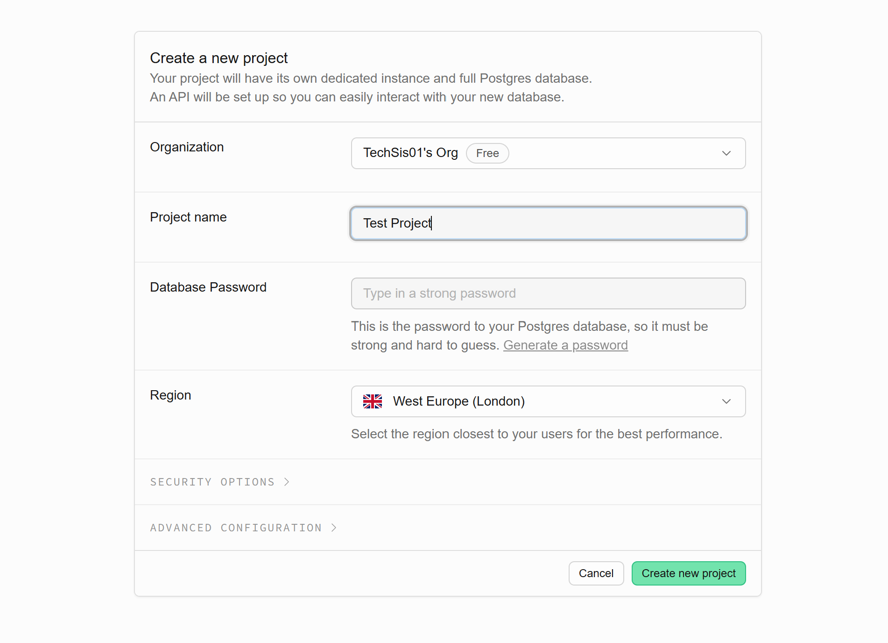
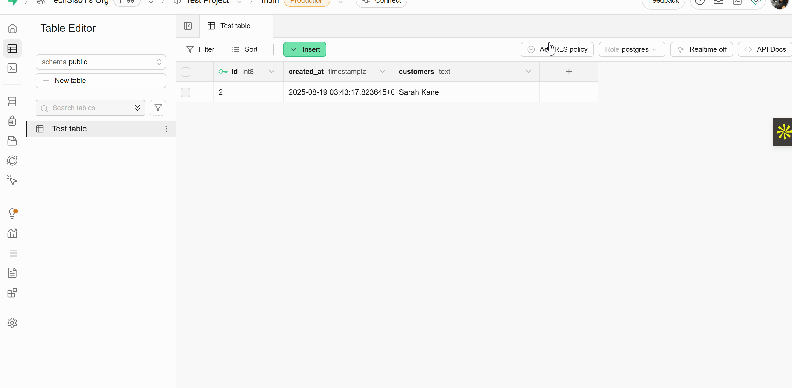

Let’s get you started with using Supabase in a React app. By the end of this tutorial, you’ll know how to:

1. Set up a new Supabase project
2. Add some sample data to your database
3. Fetch and display that data in your React app

## Pre-requisites
Before we begin, make sure you have:

- The latest version of Node.js installed on your machine
- A basic React project set up.

Once you have all that ready, you're good to go!

### Step 1: Create a Supabase project

Visit [database.new](https://database.new/) to create a new Supabase project.

:::note
If this is your first time,you will be prompted to sign up for a Supabase account, we recommend signing up with your Github account for a smoother experience. 
:::
Enter a project name that reflects what you’re building, and set a strong password to secure the PostgreSQL database that will be created for you automatically.
Once done, click **Create New Project** to proceed to the next step.


### Step 2: Setup your database
In Supabase, data is stored in tables. Think of a table like a spreadsheet: each column represents a type of information, and each row represents a single entry of that information.

You can set up your database using either the [Table Editor](https://supabase.com/dashboard/project/_/editor) or the [SQL Editor](https://supabase.com/dashboard/project/_/sql/new). For this tutorial, we’ll use the Table Editor to get you started.

Let’s create a simple table called Customers to store a list of customers for a product.

By default, Supabase adds an id column and a created_at column to your table. You can remove them if you want, but for this tutorial we’ll keep them. Next, add a new column for your customers. Once you’re done, click Save to create the table.

### Step 3: Inset a row
Once your table with columns are created, click on the insert button at the top of the table to enter your first data entry.


### Step 4: Add RLS policy
To make your database publicly readable, create an RLS Policy and enable read access for all users. 


### Step 5: Install Supabase client library
```supabase-js``` offers the fastest and most efficient way to work with Supabase in a React Application. Head over to your already created React application and enter the command below in your terminal.
```bash
cd my-app && npm install @supabase/supabase-js
```
:::tip
Check that supabase-js is among your list of dependencies in your package.json file to confirm a successful installation.
:::


### Step 6: Declare your environment variables

Navigate to your Supabase Project dashboard. Go to Settings, select **Data API** from the sidebar, and copy your **Project URL**. Then, click on **API Keys** to copy the ```anon public``` key.

Create a file named .env.local in the root directory of your project (same level as package.json). Add the following content, replacing the placeholders with the Project URL and anon public key you copied:

```
VITE_SUPABASE_URL=<SUBSTITUTE_SUPABASE_URL>
VITE_SUPABASE_PUBLISHABLE_KEY=<SUBSTITUTE_SUPABASE_PUBLISHABLE_KEY>
```

### Step 7 : Fetch and display your data
On your ```App.jsx``` create a ```getCustomers``` function to fetch and display the data on your React app using the Supabase client we installed earlier. 

```javascript
import { useEffect, useState } from "react";
import { createClient } from "@supabase/supabase-js";

const SUPABASE_URL = import.meta.env.VITE_SUPABASE_URL
const SUPABASE_PUBLISHABLE_KEY = import.meta.env.VITE_SUPABASE_PUBLISHABLE_KEY

const supabase = createClient(SUPABASE_URL, SUPABASE_PUBLISHABLE_KEY);

function App() {
  const [customerList, setCustomerList] = useState([]);

  useEffect(() => {
    getCustomers();
  }, []);

  async function getCustomers() {
    const { data } = await supabase.from("test_table").select();
    setCustomerList(data);
  }


  return (
    <div>
      {customerList.map((customer) => (
        <p key={customer.id}>{customer.customers}</p>
      ))}
    </div>
  );
}

export default App;

```

### Step 8 : Start your app
Go ahead and start your development server by running:
```
npm run dev
```
Open your project on your browser and you will see the data earlier created in your database. 

Now that you know how to start up a React project with Supabase, you can go ahead and learn how to:
- [Authentication for Supabase APIs](https://supabase.com/docs/reference/api/introduction)
- [Add more items to your database](https://supabase.com/docs/guides/database/import-data)
- [Create a Supabase Project using the Management API](https://supabase.com/docs/reference/api/v1-create-a-project)